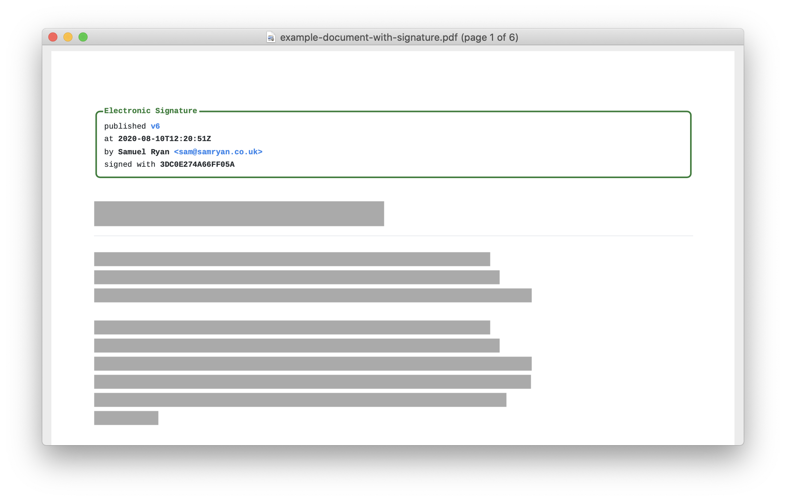

# Document Sign

A GitHub Action for generating an Electronic Signature for your commit, tag or
release. Designed to be used as part of a workflow which
[publishes signed documents][publish].

```yaml
shrink/actions-document-sign@v1
```

## Requirements

* An Electronic Signature is only produced for a commit that is
  [signed and verified][signed-commits], the action will fail for a commit that
  is not signed or signed but not verified.

## Inputs

All inputs are optional, by default your Electronic Signature destination is
`.signature` in the workspace directory.

| ID  | Description | Example |
| --- | ----------- | ------- |
| `destination` | Filepath to the signature's destination | `.signature` |
| `template` | Filepath to a template, either an [included template][templates] or your own | `cute.html` |
| `primary` | Primary colour in template | `#1e7e34` |
| `secondary` | Secondary colour in template | `#2f80ed` |

## Outputs

| ID  | Description | Example |
| --- | ----------- | ------- |
| `signature` | Electronic Signature File | `.signature` |
| `label` | Label (tag or commit hash) of the document published | `v1` |

### Templates

#### `cute.html`

A simple HTML template suitable for use in HTML or Markdown.



## Examples

### Sign and Upload Artifact

Create an Electronic Signature for a commit and attach it as a build Artifact
as `{label}.signature`.

```yaml
jobs:
  sign-and-upload:
    runs-on: ubuntu-latest
    name: Sign And Upload
    steps:
      - name: Checkout
        uses: actions/checkout@v2
      - name: Create Electronic Signature
        uses: shrink/actions-document-sign@v1
        id: create-signature
      - name: Upload Signature
        uses: actions/upload-artifact@v2
        with:
          name: ${{ steps.create-signature.outputs.label }}.signature
          path: ${{ steps.create-signature.outputs.signature }}
```

### Sign Markdown and Publish PDF As Release

Using [actions-document-publish][publish] and [get-release][get-release] to
prepend an Electronic Signature to a set of Markdown documents which is then
turned into a PDF and attached to the Release.

```yaml
jobs:
  sign-and-publish:
    runs-on: ubuntu-latest
    name: Sign And Publish
    steps:
      - name: Checkout
        uses: actions/checkout@v2
      - name: Create Electronic Signature
        uses: shrink/actions-document-sign@v1
        id: create-signature
      - name: Publish PDF Document
        uses: shrink/actions-document-publish@v1
        id: publish-document
        with:
          sources: '${{ steps.create-signature.outputs.signature }} document.md'
      - if: github.event_name == 'release' && github.event.action == 'published'
        name: Get Release
        id: release
        uses: bruceadams/get-release@v1.2.0
      - if: github.event_name == 'release' && github.event.action == 'published'
        name: Upload PDF To Release
        id: upload-release-asset
        uses: actions/upload-release-asset@v1
        with:
          upload_url: ${{ steps.release.outputs.upload_url }}
          asset_path: ${{ steps.publish-document.outputs.pdf }}
          asset_name: 'document-${{ steps.create-signature.outputs.label }}.pdf'
          asset_content_type: application/pdf
```

## Notes

A number of dependencies must be included as part of the project due to
dynamic require behaviour used in openpgp that is not supported by the ncc build
tool ([#538][ncc-538]).

[signed-commits]: https://docs.github.com/en/github/authenticating-to-github/managing-commit-signature-verification
[templates]: #templates
[publish]: https://github.com/shrink/actions-document-publish
[ncc-538]: https://github.com/vercel/ncc/issues/538
[get-release]: https://github.com/bruceadams/get-release
